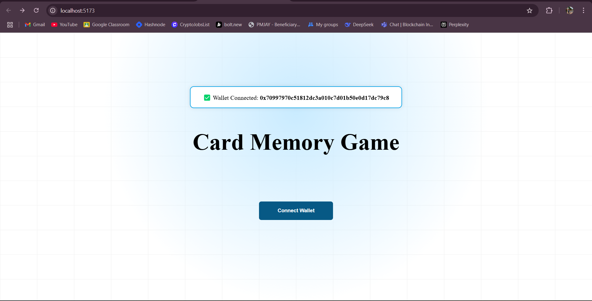
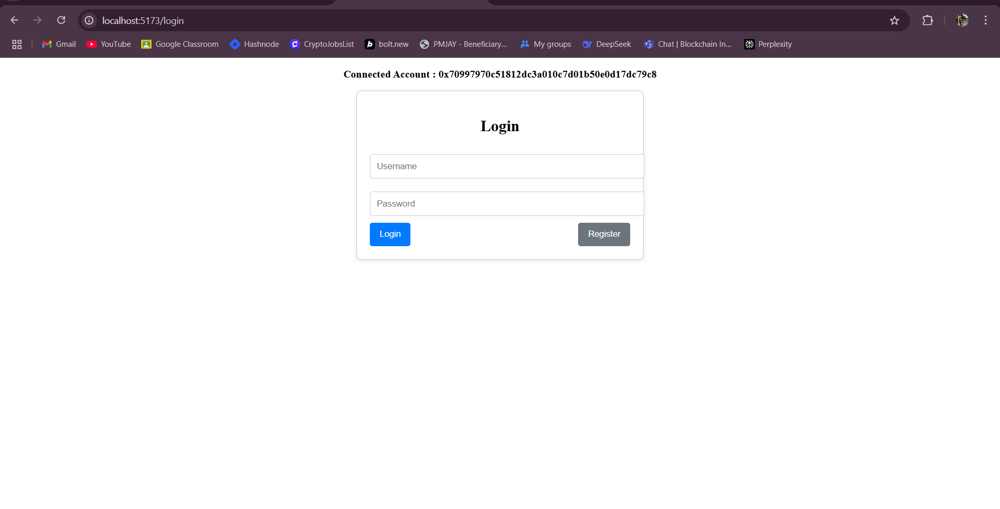
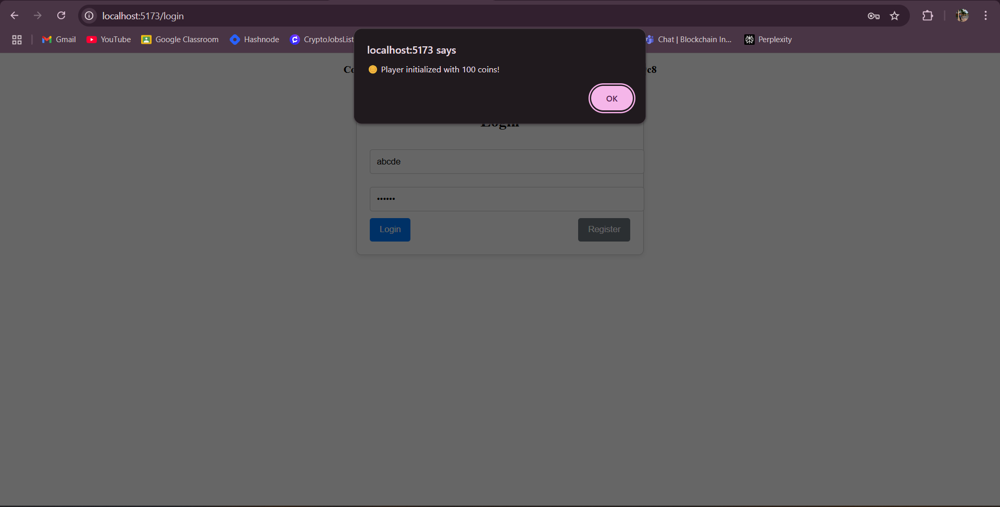
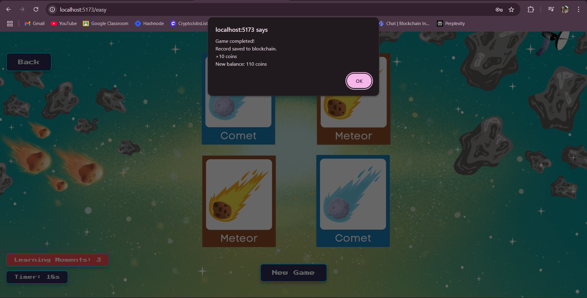
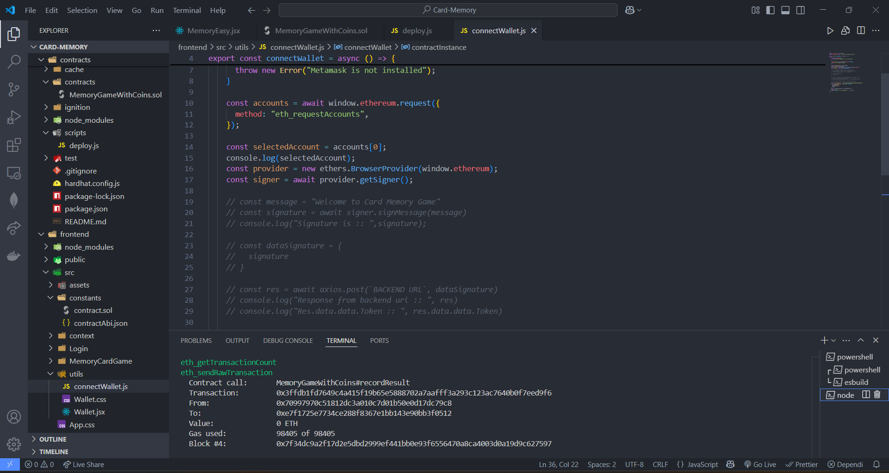
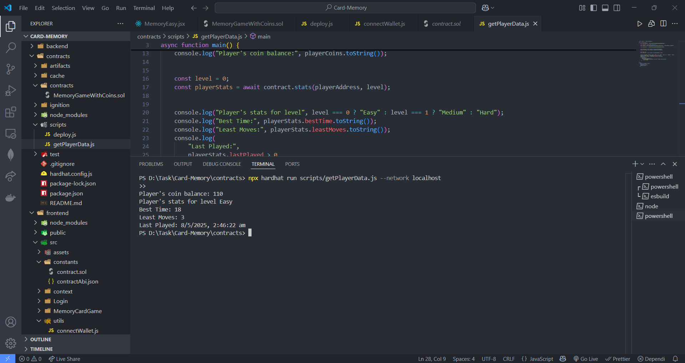

# Echoes of Aetherium – Skill Test Submission  
**Submitted by: Vaibhav Kolhe**  

## Overview  
For this skill test, I thoroughly analyzed the provided card memory game codebase before approaching the implementation. Although I had several ideas to enhance the game's logic, I kept UI changes minimal to respect the existing design structure. I've implemented all the required tasks for both the **Web3 Developer** and **Blockchain Developer** roles, detailed below.

---

## Web3 Developer Tasks

### ✅ Task 1 – Implement MetaMask Wallet Connection  
To handle wallet connectivity, I created a reusable `connectWallet.js` utility that integrates MetaMask using `ethers.js`.  
Additionally, I created a `context` folder with a global context provider (`WalletContext.js`) to ensure that the `userAddress` and `contractInstance` are available throughout the app without reinitializing the contract repeatedly.

**Highlights:**  
- Uses React Context API for global state management.
- Efficient and modular wallet connection logic.

📸 

---

### ✅ Task 2 – Display Connected Wallet Address  
Once the wallet is connected:
- A dialog appears confirming the connected wallet address.
- On the login page, a message displays the active address at the top for user clarity.

📸 

---

## Blockchain Developer Tasks

### ✅ Task 1 – Solidity Smart Contract for Game Logic  
I implemented a smart contract that tracks gameplay data on-chain. It includes:
- Player initialization with 100 in-game coins.
- +10 coins on a correct match, -2 coins on a wrong attempt.
- Storage of player statistics such as level, matched pairs, and time.

The contract sets the foundation for future features like a global scoreboard. Though I didn’t implement the scoreboard UI due to constraints, the data is already being recorded and could be easily extended.

**Possible Improvements:**  
- Upgrade to ERC20 tokens for coin mechanics.
- On-chain leaderboard integration using stored player data.

📸 
📸 

---

### ✅ Task 2 – Deploy Locally Using Hardhat and Integrate with Frontend  
Steps followed:
1. Initialized a Hardhat project and created `GameLogic.sol`.
2. Wrote scripts for deployment (`deploy.js`) and interaction (`getPlayerData.js`).
3. Configured `hardhat.config.js` for the local node.
4. Compiled contracts to generate the ABI and artifacts.
5. Deployed the contract while running `npx hardhat node`.
6. Interacted with the contract on the frontend.
7. Also tested the contract deployment and interaction on the Sepolia testnet.

📸 
📸 

---

## Final Notes  
I truly enjoyed working on this project and tried to give my best to meet your expectations. While working within the provided structure, I ensured solid integration between the frontend and blockchain layers. I’m excited about the possibility of contributing to the Echoes of Aetherium team and hope this project demonstrates both my passion and capabilities.

Thank you for the opportunity!

—  
**Vaibhav Kolhe**  
